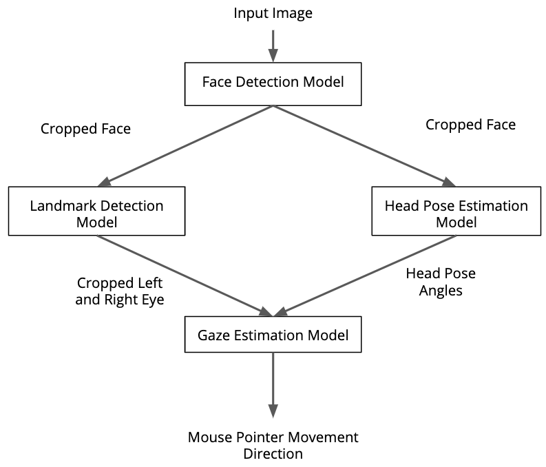
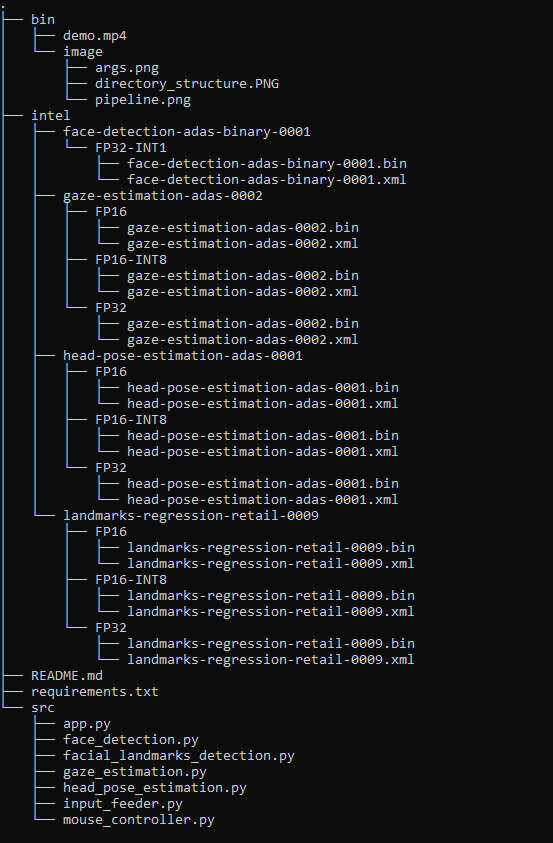
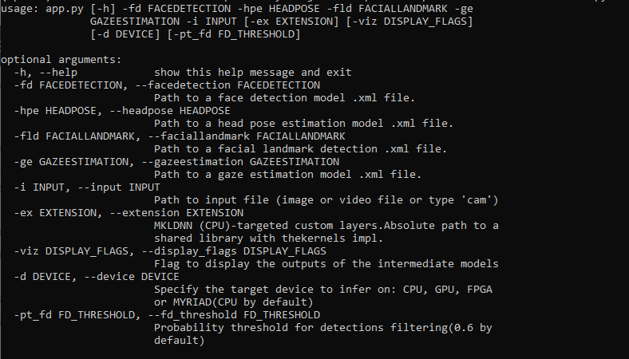

# Computer Pointer Controller
This is a computer vision application making use of a blend of several computer vision models. This app enables controlling a mouse pointer through the movement of the head and eyes.



## Project Set Up and Installation
- *Device Specifications*

| | Details |
| ------------------- | ------------- |
| Operation System | Windows 10 Pro |
| Processor | Intel(R) Core(TM) i5-5200U CPU @ 2.20 GHz |
| OpenVINO™ Toolkit version | v2020.1 |
| Device | CPU |

- Install Intel® Distribution of OpenVINO™ toolkit. Guide to install on your platform [HERE](https://docs.openvinotoolkit.org/latest/)

-  Create a virtual environment to work in and activate it:
  ```python3 -m venv cpcenv```
- cd to environment path and active it
  ```cpcenv\Scripts\activate.bat```
- Install necessary libraries
  ```pip install -r requirements.txt```
- set the openvino environment variable. (Since i'm using openvino 2020.1, On my Windows PC it will be):
```C:\Program Files (x86)\IntelSWTools\openvino_2020.1.033\bin\setupvars.bat```
- Download models
  ```
      cd C:\Program Files (x86)\IntelSWTools\openvino\deployment_tools\tools\model_downloader\intel
  ```

    1. [Face Detection Model](https://docs.openvinotoolkit.org/latest/_models_intel_landmarks_regression_retail_0009_description_landmarks_regression_retail_0009.html)
``` python downloader.py --name face-detection-adas-binary-0001 -o <directory to save the model> ```
    2. [Facial Landmarks Model](https://docs.openvinotoolkit.org/latest/_models_intel_gaze_estimation_adas_0002_description_gaze_estimation_adas_0002.html)
``` python downloader.py --name landmarks-regression-retail-0009 -o <directory to save the model> ```
    3. [Head Pose Estimation Model](https://docs.openvinotoolkit.org/latest/_models_intel_head_pose_estimation_adas_0001_description_head_pose_estimation_adas_0001.html)
``` python downloader.py --name head-pose-estimation-adas-0001 -o <directory to save the model> ```
    4. [Gaze Estimation Model](https://docs.openvinotoolkit.org/latest/_models_intel_face_detection_adas_binary_0001_description_face_detection_adas_binary_0001.html)
``` python downloader.py --name gaze-estimation-adas-0002 -o <directory to save the model>```


## Demo
##### _Project directory structure_



##### _Sample code to run the project_

```
python3 app.py -fd <project directory>/intel/face-detection-adas-binary-0001/FP32-INT1/face-detection-adas-binary-0001.xml -hpe <project directory>/intel/head-pose-estimation-adas-0001/FP32/head-pose-estimation-adas-0001.xml -fld <project directory>/intel/landmarks-regression-retail-0009/FP32/landmarks-regression-retail-0009.xml  -ge <project directory>/intel/gaze-estimation-adas-0002/FP32/gaze-estimation-adas-0002.xml -i <project directory>/bin/demo.mp4
```

## Documentation
*TODO:* Include any documentation that users might need to better understand your project code. For instance, this is a good place to explain the command line arguments that your project supports.



## Benchmarks
*TODO:* Include the benchmark results of running your model on multiple hardwares and multiple model precisions. Your benchmarks can include: model loading time, input/output processing time, model inference time etc.
|   |  INT8 | FP16  | FP32  |
|---|---|---|---|
| Total Model loading time (s)  | 3.02  | 1.39  |  1.29 |
| Inference time (ms)  | 40.15  | 42.13  | 50.01 |

## Results
- The lower the precision, the faster the inferenece. Though there is no much difference in inference time for the various precisions, with FP16 precision inference time is higher than with INT8, and FP32 higher than FP16.
- The lower the precision, the more model loading time. At INT8 precision models took more time to load compared to FP16 and FP32 models.  
## Stand Out Suggestions
This is where you can provide information about the stand out suggestions that you have attempted.

### Edge Cases
When running the app using camera input I made sure I was under good lighting conditions in order to avoid input errors.
